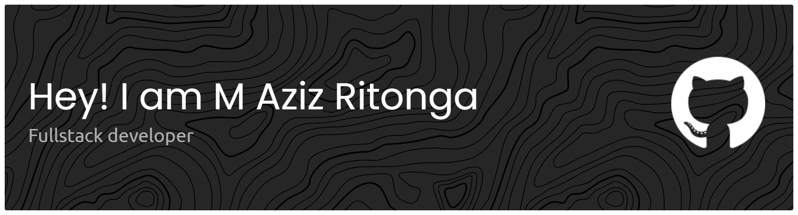

Welcome to my GitHub !
I am an <b>IT Support Specialist</b>, <b>Programmer</b>, and <b>Network Engineer</b> with extensive hands-on experience in real-world IT environments.

Throughout my career, I’ve worked on numerous systems, troubleshooting tasks, and development projects. For personal and professional reasons, I rarely showcased my work publicly.

Today, I’m committed to gradually sharing my projects, ideas, and technical journey — starting here.

Thank you for stopping by
# Skills :
## - Programming

## - Networking

 
